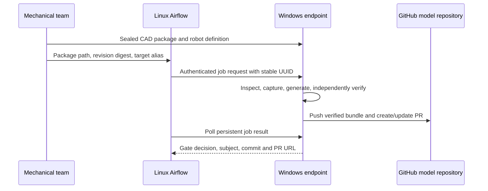

# Apache Airflow deployment

Apache Airflow is the single operator interface, through its Web UI or DAG API.
Linux runs its scheduler. A Windows endpoint with licensed SolidWorks runs the
complete local workflow and serializes CAD execution.



The DAG is manually triggered for a mechanical handoff. The endpoint rechecks
the requested CAD revision and author inventory before execution. Queued jobs
run serially. Identical request retries return the existing job; a UUID reused
with different content returns HTTP 409. An interrupted running job fails
explicitly on restart and needs a new reviewed request.

## Windows endpoint

Install the same pipeline release used locally. Create separate handoff,
delivery, state and model-clone directories. Generate a random token of at
least 32 characters and save it outside the repositories with access restricted
to the execution user. Configuration contains the token-file path, not its value.

```json
{
  "schema_version": "solidworks-to-urdf.endpoint/v1",
  "package_root": "C:/handoffs",
  "output_root": "C:/deliveries",
  "state_root": "C:/description/state",
  "token_file": "C:/description/secrets/endpoint-token.txt",
  "host": "127.0.0.1",
  "port": 8765,
  "targets": {
    "arm": {
      "repository": "C:/description/models-arm",
      "base": "feature/arm"
    }
  }
}
```

```powershell
description serve --config C:\description\endpoint.json
```

Run it as the logged-in SolidWorks user, including after login if automatic
startup is configured. Do not run native CAD jobs as a Session 0 Windows service.
The endpoint owns only its pipeline jobs and CAD sessions. It does not dismiss
dialogs in other applications or manipulate their processes.

For automatic startup, register an interactive task under that same execution
account after verifying the foreground command:

```powershell
$account = [Security.Principal.WindowsIdentity]::GetCurrent().Name
$action = New-ScheduledTaskAction -Execute C:\description\.venv\Scripts\description.exe -Argument 'serve --config C:\description\endpoint.json'
$trigger = New-ScheduledTaskTrigger -AtLogOn -User $account
$principal = New-ScheduledTaskPrincipal -UserId $account -LogonType Interactive -RunLevel Limited
$settings = New-ScheduledTaskSettingsSet -ExecutionTimeLimit ([TimeSpan]::Zero) -AllowStartIfOnBatteries -DontStopIfGoingOnBatteries
Register-ScheduledTask -TaskName description-solidworks-endpoint -Action $action -Trigger $trigger -Principal $principal -Settings $settings
Start-ScheduledTask -TaskName description-solidworks-endpoint
```

Ensure Git/GitHub authentication and executable paths are available to this
account. Keep the desktop logged in and the computer awake while processing.

Loopback HTTP must travel through an authenticated SSH tunnel from Linux. For a
remote bind, configure `tls_cert` and `tls_key`; plaintext remote binding is
rejected. Keep the bearer token in the Airflow connection, never a DAG, command
argument, model bundle or committed configuration.

## Linux scheduler

Follow the [deployment installation guide](../deploy/airflow/README.md) to set
up the dedicated Python 3.12 environment, PostgreSQL, authentication,
connection and services. It includes the exact tested dependency lock and
token-file connection helper. Airflow dependencies stay in its own environment.
The connection points to the tunneled endpoint and supplies the bearer token.

After login, open `solidworks_to_urdf`, enable it, and select **Trigger DAG**.
Submit a handoff with these fields; API submissions use the same DAG:

```json
{
  "package": "arm/r2",
  "revision_sha256": "<SHA-256 of the exact cad-revision.json file>",
  "target": "arm",
  "repository_slug": "<owner>/<model-repository>",
  "base": "feature/arm",
  "conn_id": "solidworks_windows"
}
```

The DAG validates this request, starts the job, waits for its terminal result,
and requires a passing quality report plus a successful submission receipt and
PR URL. The `wait_for_job` task logs native stages and failure diagnostics;
`confirm_job` returns the events, verified subject, commit and PR URL. Reusing
a DAG-run identity preserves the endpoint UUID across task retries. A corrected
handoff starts a new DAG run.

## Deployment acceptance

Before service handoff, demonstrate authenticated connectivity, a complete
native passing delivery and PR, a repeated request with no second capture, a
rejected revision digest, a rejected path escape, a failed quality gate with no
publication, and restart recovery. Verify the actual Airflow DAG imports and
runs in its isolated deployment environment. A mocked endpoint tests DAG
control behavior; it does not replace the native end-to-end rehearsal.
