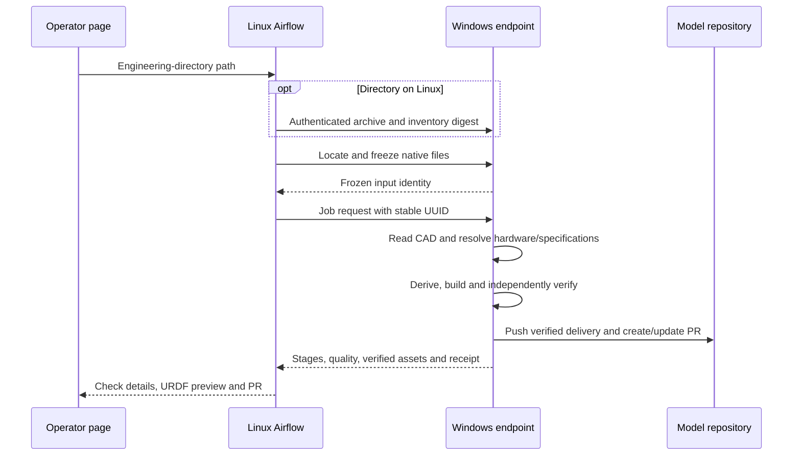

# Deployment

This guide defines platform responsibilities, configures the released Windows
worker and Linux orchestration, and records acceptance requirements for the
target interface. The [operations guide](operations.md) owns the engineering
workflow; the [Airflow installation guide](../deploy/airflow/README.md) owns Linux commands.

## Release and deployment status

| Capability | Status |
|---|---|
| Published v1.0.0 | Prepared-package native capture, verified URDF, model PR submission, frozen replay and Airflow orchestration are released |
| CAD-only input and automatic definition | Required target; native semantic discovery and generated-input verification are not released |
| One-folder transfer and hardware routing | Under development; prepared-package transport does not establish CAD-only operation |
| Operator page and embedded URDF viewer | Planned; not commissioned |
| Detailed engineering-check display | Required target; per-item automatic results and engineer confirmations are not implemented in Airflow |
| RTX 4080 server and shared operator URL | Not commissioned; no live address is asserted here |

The installation sections below configure v1.0.0. It requires a prepared package
containing `robot.yaml` and `cad-revision.json`, maintained by the platform team.
These are not mechanical-team delivery requirements. Existing v1.0.0 assets
and their tag remain unchanged.

## Windows endpoint

### Install the runtime

Use Windows x86_64 with licensed SolidWorks 2026 (revision 34), Python 3.12,
Git and GitHub CLI. Download `description-1.0.0-windows-cp312-x86_64.zip`, verify
it against the release SHA-256 manifest, and extract it. From that directory:

```powershell
py -3.12 -m venv C:\description\.venv
C:\description\.venv\Scripts\python.exe -m pip install --no-index --require-hashes --find-links wheels -r requirements.lock
C:\description\.venv\Scripts\description.exe doctor
```

Use the same recorded pipeline release on both platforms. `doctor` checks
runtime availability without opening CAD; it does not qualify an engineering model.

### Configure and start

Create separate input, output, state and model-clone directories. Complete
[model repository setup](#model-repository-setup) before running jobs.
Generate a random token of at least 32 ASCII characters and keep it in a
private file outside the repositories. Configuration holds its path, not its value.
Save the following as `C:\description\endpoint.json`:

```json
{
  "schema_version": "solidworks-to-urdf.endpoint/v1",
  "package_root": "C:/handoffs",
  "output_root": "C:/deliveries",
  "state_root": "C:/description/state",
  "token_file": "C:/description/secrets/endpoint-token.txt",
  "host": "127.0.0.1",
  "port": 8765,
  "targets": {
    "arm": {
      "repository": "C:/description/models-arm",
      "base": "feature/arm"
    }
  }
}
```

Start it as the logged-in SolidWorks execution user:

```powershell
C:\description\.venv\Scripts\description.exe serve --config C:\description\endpoint.json
```

Keep that desktop logged in and the computer awake during processing. Native
jobs run serially in owned CAD sessions; do not deploy capture as a Session 0
Windows service. The endpoint does not manage unrelated applications.

Loopback HTTP reaches Linux through an authenticated SSH tunnel. A remote
bind requires `tls_cert` and `tls_key`; plaintext remote binding is rejected.
Store the bearer token in the Airflow connection, outside DAGs and model bundles.

### Optional startup at login

After verifying foreground operation, register an interactive task under the
same account. Its Git/GitHub credentials and executable paths must be available:

```powershell
$account = [Security.Principal.WindowsIdentity]::GetCurrent().Name
$action = New-ScheduledTaskAction -Execute C:\description\.venv\Scripts\description.exe -Argument 'serve --config C:\description\endpoint.json'
$trigger = New-ScheduledTaskTrigger -AtLogOn -User $account
$principal = New-ScheduledTaskPrincipal -UserId $account -LogonType Interactive -RunLevel Limited
$settings = New-ScheduledTaskSettingsSet -ExecutionTimeLimit ([TimeSpan]::Zero) -AllowStartIfOnBatteries -DontStopIfGoingOnBatteries
Register-ScheduledTask -TaskName description-solidworks-endpoint -Action $action -Trigger $trigger -Principal $principal -Settings $settings
Start-ScheduledTask -TaskName description-solidworks-endpoint
```

## Model repository setup

Configure Git identity and GitHub authentication for the Windows execution user,
then create a dedicated clean model clone. Replace `<owner>/<model-repository>`
with the private model repository, separate from the tool repository:

```powershell
gh auth login
gh auth setup-git
git clone https://github.com/<owner>/<model-repository>.git C:\description\models-arm
```

Existing hardware branches need no initialization. For a new hardware, the
model owner creates its branch once in this dedicated clean clone:

```powershell
git -C C:\description\models-arm switch --orphan feature/arm
Set-Content -Encoding utf8 C:\description\models-arm\README.md "# arm model"
git -C C:\description\models-arm add README.md
git -C C:\description\models-arm commit -m "Initialize arm model branch"
git -C C:\description\models-arm push origin feature/arm
```

A passing delivery creates or updates `work/solidworks/<hardware>` and its PR
against `feature/<hardware>`. Approval and model release remain separate from
candidate submission. Native CAD and model history stay private.

## Linux scheduler

Follow the [Airflow installation guide](../deploy/airflow/README.md) in order:
prepare PostgreSQL, install the isolated runtime, configure the Windows
connection, start services, log in and trigger a delivery. The released DAG
uses six explicit fields and expects the prepared package under Windows
`package_root`; it does not transfer a Linux directory or infer hardware routing.

The DAG validates the request, starts the native job, waits for completion and
requires a passing quality report, submission receipt and PR URL. Diagnostics
are in `wait_for_job`; `confirm_job` returns the verified subject, commit and PR.
Retries preserve the UUID derived from the Airflow run ID. Reusing that UUID
with changed content returns HTTP 409. Restart marks an interrupted running
job failed; corrected inputs start a new run.

## Deployment contract

The following requirements define the target deployment; they are not installed
by the v1.0.0 procedures above.

One RTX 4080 Linux server hosts the operator page, Airflow and private PostgreSQL.
An HTTPS reverse proxy exposes one authenticated operator URL. The page uses
Airflow's DAG and login; platform administration remains restricted. One
reachable Windows worker serializes licensed SolidWorks execution.

### Folder resolution

The target request contains one field:

```json
{"handoff_path": "/srv/handoffs/arm/r2"}
```

| Engineering-directory location | Required handling |
|---|---|
| Absolute Linux path | Read on the server, archive and transfer to Windows; verify the received native inventory |
| Absolute Windows path | Read on the configured worker and copy into the managed input store |
| Relative path | Resolve under `package_root` and copy into the managed input store |

A path on another computer must first become accessible to the platform.
Pasting it into a browser does not grant access. Transport preserves native
contents and relative references; input directories contain engineering files,
not authored YAML or manifests.



Hardware identity and structural revision come from native engineering records.
The worker must resolve exactly one configured destination after reading CAD;
unknown or ambiguous identity blocks publication. Platform configuration owns
clones, branches and the Airflow connection selected by
`SOLIDWORKS_ENDPOINT_CONN_ID` (default `solidworks_windows`). Unsafe paths and
malformed transport are rejected before native execution.

All native files are frozen and bound to an inventory digest. Queued jobs
recheck that identity before capture. Retries preserve frozen inputs and the
native UUID; changes require a new run.

### Verified preview and check display

The viewer must load the passing delivery's actual URDF and meshes with joint
position and limit controls. Planned server-side access uses authenticated
`GET /v1/jobs/<uuid>/preview` and `GET /v1/jobs/<uuid>/artifacts/<relative>`.
Only verified viewer assets may be served; CAD, evidence and worker paths are
excluded. Tokens remain server-side and viewer dependencies are bundled.

Each engineering check must show its ID, automatic result, engineer confirmation,
evidence, affected objects and corrective guidance, bound to the run and
structural version. Unsupported, unexecuted or unconfirmed items remain visible.
The [mechanical specification](mechanical-handoff-spec.md#112-检查报告与-airflow-展示)
defines these result states. A viewer does not make an independent quality decision.

## Deployment acceptance

Accept the released foundation only after demonstrating:

- Authenticated Linux-to-Windows connectivity and an actual native passing delivery and PR.
- Retry without duplicate capture, rejection of a changed revision digest and path escape.
- Quality failure without publication and recovery after a worker restart.
- Successful DAG import and execution in the pinned Airflow environment.

Acceptance of the target interface additionally requires:

- All three folder locations, verified transfer and rejection of changed inventories.
- CAD-only identity, body/joint recognition, specification resolution and generated definitions.
- Independent checking against native evidence; no guessed facts or routing on ambiguous identity.
- Single-page login, submission, progress and complete per-item check/confirmation display.
- Preview of actual verified URDF motion and limits; rejection of failed, changed or non-viewer assets.

Retain measured end-to-end results. A mocked endpoint can test orchestration,
but it cannot replace native rehearsal or commission a deployment.
