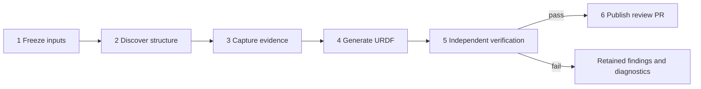

# Design

One operator workflow: **SolidWorks folder → Airflow → verified URDF → review PR**.

## 1. Core principles

- Single source of truth.
- Automatic derivation.
- Verified publication.

## 2. How the system works

SolidWorks defines geometry, assembly relationships, motion and datums. Versioned
component records in the platform's controlled library supply physical and drive
specifications. CAD references identify their approved versions.
Each fact has one effective definition and a recorded source; conflicting or
ambiguous definitions stop derivation. Mechanical engineers maintain these inputs;
the pipeline generates definitions, models, meshes and reports.



The pipeline has **six engineering steps**. Their single machine-readable definition
is [`stage-contract.json`](../src/description_pipeline/stage-contract.json); the
same definition renders this table, the Airflow DAG documentation and the operator view.
Generated-input inspection is the input check of `capture`.

<!-- stage-contract:start -->
| # | Stage | Input | Input QC | Output | Output QC |
|---|---|---|---|---|---|
| 1 | `freeze` — Freeze inputs | Saved SolidWorks folder | Admitted path, regular files and native package | Frozen handoff, file inventory and digest | Exact file inventory and handoff digest |
| 2 | `discover` — Discover structure | Frozen handoff and versioned component records | Unchanged handoff and controlled discovery settings | Native observations and findings; Derived definition and structural revision | Unambiguous identity, bodies, motion, names and references; Native evidence, original files, revision and routing agree |
| 3 | `capture` — Capture evidence | Prepared definition, saved CAD and native runtime | Derived definition, structural revision and archive integrity; Native platform and isolated URDF consumer readiness | Collected CAD, raw measurements, native meshes and manifest | Complete snapshot with capture and saved-state guards; Original handoff unchanged after capture |
| 4 | `generate` — Generate URDF | Frozen native evidence | Snapshot integrity before consumption | Canonical model; URDF and local meshes; Tool identity and file subject | Valid canonical schema and complete hashed delivery |
| 5 | `verify` — Independent verification | Original evidence and actual generated files | Generated file subject unchanged | Deterministic per-object quality report | All required native, physical, frame, geometry and consumer checks; Saved report equals independent recomputation |
| 6 | `publish` — Publish review PR | Verified delivery and configured model repository | Reverified delivery, clean repository and deterministic review branch | Candidate commit and PR receipt | Copied, staged and committed bytes match the verified subject; Remote commit, PR head/base and subject agree |
<!-- stage-contract:end -->

Each boundary records its actual check result before the next step consumes its
output. Missing checks remain `not_run`; a failure blocks downstream work.
Each receipt declares its `execution_scope`: a complete endpoint job covers all
six stages, while maintenance commands cover only the stages they execute
([operations](operations.md#6-independent-review-and-recovery)); unexecuted
native stages are reported as out of scope, never as qualified.
[Quality](quality.md) defines the independent gates and tolerances.
[The mechanical specification](mechanical-handoff-spec.md#111-自动检查与工程师确认)
defines the remaining external engineering facts. Passed automatic checks are
accepted without repeated manual review. After verification, the page shows only
this external review scope; approvals remain in the matching PR or controlled
records and are not inferred by the portal. Unsupported capabilities stay visible
on their responsible step.

Any engineering step can start a new linked run. Upstream results are reused
only after checking their frozen inputs, tool and dependency identities, and
checkpoint integrity. The selected step and all downstream steps execute again;
prior runs remain immutable. Reports identify reused evidence and retain its
original timestamps. A missing or invalid prerequisite points to the earliest
safe restart step. Transport recovery reconnects an existing job and remains
separate from engineering reruns.

Native input and collected evidence remain immutable. The canonical model contains
topology, transforms, geometry and full physical properties. Verification reconstructs
expectations from native observations and inspects the actual XML, mesh bytes and
isolated consumer loading. Publication checks the copied, staged and committed
bytes, then confirms the remote commit and PR head/base. A candidate PR requires
engineering approval before model release.

Publication generates byte-preserving Git attributes and rejects conflicting
repository settings. Frozen evidence and controlled records retain their original
bytes through commits and fresh checkouts.

The pipeline ID is `solidworks-to-urdf`; every run has a UUID. Source revisions,
controlled records, tool code, dependencies, environment and file hashes bind the
execution. Transport retries reconnect to the same UUID and frozen inputs. A
terminal native failure or source correction requires a new run. Frozen evidence
can be rebuilt on Linux or Windows without reopening CAD.

Airflow's four transport tasks resolve the folder, submit the job, poll it and
confirm its result. They do not execute separate CAD steps. The DAG documentation
shows the six-step contract; task logs show live states and terminal QC details;
`engineering_stages` XCom retains the terminal summary, including failures. The
operator page shows each step's inputs, input QC, outputs, output QC and evidence.
`reports/stages.json` retains the detailed run receipt.

When a folder contains more than one saved `.SLDASM`, the page always lists their
relative paths and requires the operator to choose the main assembly before the run
starts (a single assembly is selected automatically). The choice travels with the
frozen handoff and its evidence, is reused by retries and reruns, and resolves only
which assembly is the entry — every identity, dependency and physical check still
applies to the native data.

## 3. How engineering is organized

| Repository or system | Responsibility |
|---|---|
| Public `description-pipeline`, `main` | Current tool, specifications and neutral tests |
| Private `description`, `feature/<hardware>` | Reviewed inputs and model deliveries for a hardware design |
| Private `description`, `work/solidworks/<hardware>` | Generated candidate and its review PR |
| Private `description`, `release/<hardware>/<release>` | Approved, frozen model delivery |
| Mechanical PDM, Git LFS or controlled directory | Retrievable CAD revisions and engineering approvals |
| Controlled component library | Versioned physical and drive specifications |

`main` contains the smallest complete current system. Intermediate implementations
remain in Git history. Tool releases use ordinary version tags; each model records
the tool identity used to build it.

```text
src/description_pipeline/
  stage-contract.json    six steps, boundary check identifiers and responsibility references
  stages.py              check observations and shared result rendering
  steps.py               the six engineering handlers
  solidworks.py          linear delivery/replay driver and output ownership
  runtime.py             installed tool and dependency identity
  sources/solidworks/    native reading and definition derivation
  model/                 canonical mechanical and physical semantics
  backends/              URDF generation
  verification/          independent native, physical and artifact checks
  repository/            verified Git and PR publication
  orchestration/         queue, Airflow, authentication and result access
  cli.py                 commissioning, diagnostics and frozen replay
tests/                   neutral, analytic and adversarial fixtures
deploy/                  platform installation and lifecycle
docs/                    specifications and operating guides
```

`steps.py` owns `freeze_inputs`, `discover_structure`, `capture_evidence`,
`generate_model`, `verify_delivery` and `publish_model`. Each handler owns its
input checks, action and output checks. Native adapters, the independent verifier
and Git publisher own their domain rules. Drivers sequence work and preserve
receipts; the renderer does not execute engineering work.

One Linux server hosts Airflow, its database and the operator page. One licensed
Windows endpoint serializes native jobs in owned processes, separate from an
engineer's CAD session. Runtime readiness precedes CAD access. Native acquisitions
bind their documented interfaces; each rebuild refreshes and verifies the owned
document once before continuation. Lost bindings or unavailable capabilities
stop execution, retain diagnostics and release owned resources.

Feishu API authentication supplies the operator's verified username. Run history
and details show each run's original submitter by that name. The authenticated
app, tenant and `open_id` remain the internal audit identity. The platform
restricts tenant and workflow permissions and keeps credentials server-side.

Approved Feishu users may start new pipeline runs and view shared results. Each
run records its initiator's stable authenticated identity and displays that
operator's original Feishu username. The run's initiator and platform
administrators can retry that run through one contextual Retry action for
positively classified transport recovery; retrying continues the same DAG run
and native job with the frozen inputs, and captured evidence and delivered
artifacts are never edited. Every terminal native failure requires a new run
after correcting the inputs or configuration. Administrators retain broader
platform administration beyond this action.

Maintainers configure storage roots and hardware routing once; operators choose
one complete engineering folder on their own computer in the page, and the
platform uploads it to its managed intake before freezing. Deployment settings
and model facts remain outside tool code.

## 4. How to operate

1. Complete the native design and engineering checks under the
   [mechanical specification](mechanical-handoff-spec.md).
2. Save the delivery configuration and collect a controlled version with its dependencies.
3. Sign in, choose the complete engineering folder in the page (Chrome or Edge)
   and start the run; the browser uploads it to the platform before anything is
   frozen. If the folder contains several assemblies, choose the main one when the
   page asks.
4. Inspect all six steps and their checks; correct engineering findings at their source.
5. Review the verified URDF, evidence and PR, and complete engineering confirmations.
6. Approve the intended uses and freeze the model release.

[Operations](operations.md) covers this workflow and recovery;
[deployment](deployment.md) covers installation and commissioning. URDF consistency,
simulation, training and hardware control have separate acceptance criteria.
