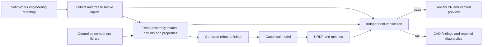

# Design

## 1. Core principles

- Single source of truth.
- Automatic derivation.
- Verified publication.

SolidWorks owns the mechanical assembly, geometry, datums, zero pose and
engineering semantics. Controlled component records supply physical and drive
specifications identified by the CAD model. Every pipeline configuration,
manifest, model and report is derived; `robot.yaml` is an internal generated
artifact, never a mechanical-team input.

## 2. How the system works



The pipeline identifies the main assembly and export configuration, records a
fixed native inventory and reads the actual saved engineering state in an
owned SolidWorks session. It derives rigid-body membership and joint relations
from assembly structure, mates, datums and any required native engineering
annotations. It resolves declared component specifications without inventing
missing limits or capabilities.

Generated definitions remain separate from original CAD and raw observations.
Verification rederives their mechanical facts from independent native evidence,
then checks the canonical model, actual XML, meshes and consumer loading.
Publication verifies the complete copied delivery and actual Git blobs.

The pipeline ID is `solidworks-to-urdf`. Each execution has a UUID. CAD bytes,
source revisions, component-library revisions, tool code, runtime and delivery
are bound by SHA-256. A retry preserves the same frozen inputs and native UUID;
a corrected handoff starts a new run. A generated configuration cannot become
an alternate source of mechanical truth.

## 3. How engineering is organized

| Location | Responsibility |
|---|---|
| Public `description-pipeline/main` | Tool code, specifications and neutral tests |
| Private `description/feature/<hardware>` | Reviewed native inputs and model deliveries |
| Private `description/work/solidworks/<hardware>` | Automatically updated model PR |
| Private `description/release/<hardware>/<release>` | Approved, frozen model delivery |
| Mechanical PDM, Git or retained directory | Controlled SolidWorks revisions |
| Controlled component library | Versioned physical and drive specifications |

Tool releases use ordinary tags such as `v1.0.0`; models record the tool identity
used. Tool source is not merged into model branches. Approved model deliveries
are frozen from their hardware branch.

```text
src/description_pipeline/
  sources/solidworks/     native collection, reading and automatic definition
  model/                 canonical semantics
  backends/               generated URDF and consumer artifacts
  verification/          independent native, physical and artifact checks
  repository/            governed publication
  orchestration/         Airflow, Windows endpoint and operator result access
  cli.py                 platform commissioning, diagnosis and replay
tests/                   neutral, analytic and adversarial regressions
deploy/airflow/          Linux orchestration deployment
docs/                    engineering requirements, workflow and deployment
```

One operator page submits to the Airflow DAG and displays progress, quality,
PR results and the actual verified URDF with joint/limit controls. The Linux
server hosts that page, Airflow and a private database; one licensed Windows
worker serializes native CAD execution. Platform configuration owns repository
routing and credentials.

Each engineering check displays its automatic result, engineering confirmation,
evidence and affected objects. Missing or unsupported checks remain explicit;
automatic consistency and design approval are separate conclusions.

The operator provides one folder path. Hardware identity and revisions come
from native engineering records; inventory hashes, configuration files,
evidence and run IDs are generated automatically. Ambiguous mechanical facts
produce actionable CAD findings, never guessed definitions.

## 4. How to operate

1. Complete and review the SolidWorks engineering model under the
   [mechanical specification](mechanical-handoff-spec.md).
2. Save the declared zero or reference configuration and collect native dependencies.
3. Select the SolidWorks directory on the operator page and start the run.
4. The pipeline freezes, reads, derives, builds, verifies and submits.
5. Resolve findings in CAD or their controlled specification source and rerun.
6. Review the verified URDF, joint motion, source evidence and delivery PR.
7. Approve and freeze the model release for the accepted uses.

The [operations guide](operations.md) describes the complete process.
[Quality](quality.md) defines acceptance, and [deployment](deployment.md)
separates the target contract from released capabilities.
