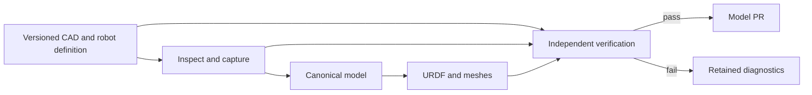

# Design

## 1. Core principles

- Single source of truth.
- Automatic derivation.
- Verified publication.

CAD owns geometry, assembly placement and datums. `robot.yaml` owns robot
semantics and the explicit selection of physical authority. The pipeline owns
every derived file. Corrections return to their owning input or generation rule.

## 2. How the system works



Capture reads saved files in an owned SolidWorks session, collects the complete
dependency closure and records numeric evidence. Generation derives joint
frames from CAD datums and combines physical properties in their declared
frames. Verification rereads inputs, raw readings, meshes and XML, then loads
the URDF with an independent consumer. Publication verifies the copied bundle
and actual Git blobs before pushing.

The pipeline ID is `solidworks-to-urdf`. Each execution has a UUID. CAD revision,
source files, tool code, runtime and delivery are bound by SHA-256. An Airflow
retry uses the same UUID and request; a corrected handoff starts a new run.

## 3. How engineering is organized

| Location | Responsibility |
|---|---|
| Public `description-pipeline/main` | Tool code, specifications and neutral tests |
| Private `description/feature/<hardware>` | Authored model inputs and reviewed deliveries |
| Private `description/work/solidworks/<hardware>` | Automatically updated model PR |
| Private `description/release/<hardware>/<release>` | Approved, frozen model delivery |
| Mechanical Git, PDM or retained handoff directory | Immutable native CAD revisions |

Tool releases use ordinary version tags such as `v1.0.0`. Models record the tool
identity they used; tool source is not merged into model branches. A model
release freezes an approved delivery from its hardware branch; its release
branch is retained without subsequent model edits.

```text
src/description_pipeline/
  sources/solidworks/     CAD contract, native capture and normalization
  model/                 canonical semantics
  backends/urdf.py        URDF and local mesh projection
  verification/          independent physical and artifact gates
  repository/urdf_pr.py   governed publication
  orchestration/         Windows endpoint and Airflow client
  solidworks.py          complete local workflow
  cli.py                 author, commissioning and replay commands
tests/                   neutral mathematical, failure and integration tests
deploy/airflow/          Linux scheduler deployment
docs/                    normative specifications and operations
```

One operator page submits to the Airflow DAG and displays its progress and
results. The Linux server hosts that page, Airflow and a private database. The
Windows endpoint serializes CAD jobs and executes the complete local workflow;
Airflow manages requests, retry identity and result visibility. The CLI serves
handoff authoring, worker commissioning, diagnosis and frozen-delivery replay.

The operator contract is one URL, one login and one value: the handoff folder
path. The pipeline derives the sealed revision, inventory digests and hardware
route from the frozen package and the deployment configuration, so digests,
repositories, branches and endpoint connections are never operator inputs. The
run reports concise stages and ends with the actual verified URDF, joint and
limit controls, its quality decision and review PR. The viewer reads verified
URDF and mesh bytes; quality decisions come from the independent report. CAD,
source evidence and execution-machine paths stay outside the viewer surface.

## 4. How to operate

1. Prepare and review the mechanical assembly, datums and physical authority.
2. Define rigid bodies, joints, signed axes, limits and acceptance bounds.
3. Seal the CAD revision and inspect the complete input package.
4. Enter the handoff folder in the Airflow operator page and track its result.
5. Resolve failed findings at their source and rerun with corrected inputs.
6. Review the passing delivery PR, including its source revision and reports.
7. Freeze the approved model release and recheck copied deliveries before use.

The [operations guide](operations.md) ties these steps to commands and expected
results. The [quality specification](quality.md) defines exactly what a passing
delivery establishes.
