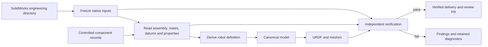

# Design

Release 1.0 uses one workflow: native SolidWorks engineering → Airflow →
verified URDF and review PR.

## 1. Core principles

- Single source of truth.
- Automatic derivation.
- Verified publication.

SolidWorks defines mechanical geometry, assembly relationships, datums and
motion. Controlled component records supply physical and drive specifications
identified by CAD. Each fact has one effective definition with a traceable source.
Robot definitions, manifests, models and reports are generated; corrections
return to their source or the generation rule.
Conflicting definitions require an explicit, recorded resolution at the source.

## 2. How the system works



The pipeline freezes the main assembly, delivery configuration and complete
native dependencies. An owned SolidWorks session reads the saved state and
derives rigid bodies, joint relationships and frames from assembly structure,
mates, datums and necessary native engineering annotations. The identity step
records native documents, configurations and occurrence paths, and binds model
interfaces to their native datums under the
[mechanical specification](mechanical-handoff-spec.md#2-命名与原生引用).
Controlled references resolve fixed specifications. Engineers confirm part
identity and cross-version changes; the report identifies checks that require
that confirmation. Missing or ambiguous facts produce findings at their source.

The canonical model carries topology, transforms, geometry and complete physical
semantics. URDF and meshes are derived from it. Mesh collection reads each
assembly occurrence's bodies in its referenced configuration and local frame,
without switching the shared part document's configuration. Original CAD, raw observations
and generated definitions remain distinct. Independent verification checks
mechanical facts against native evidence, then inspects actual XML, mesh bytes
and consumer loading. Publication repeats verification on the copied delivery
and committed Git blobs.

The pipeline ID is `solidworks-to-urdf`; each execution has a UUID. The run
records source revisions and SHA-256 inventories, and locks tool code, Python,
complete dependencies and runtime configuration. Controlled specifications and
outputs bind to that identity. A retry reuses frozen inputs and the native UUID.
A source correction creates a new version and run. Engineering approval and
simulation, training or hardware-control qualification remain separate decisions.

## 3. How engineering is organized

| Repository or system | Responsibility |
|---|---|
| Public `description-pipeline`, `main` | Tool code, specifications and neutral tests |
| Private `description`, `feature/<hardware>` | Reviewed inputs and model deliveries for one hardware design |
| Private `description`, `work/solidworks/<hardware>` | Generated candidate and its review PR |
| Private `description`, `release/<hardware>/<release>` | Approved, frozen model delivery |
| Mechanical PDM, Git LFS or controlled directory | Retrievable SolidWorks revisions and engineering approvals |
| Controlled component library | Versioned physical and drive specifications |

`main` contains the smallest complete current system. Code, interfaces and
documentation describe this workflow; intermediate implementations and
compatibility layers remain in Git history.

Tool releases use ordinary version tags such as `v1.0.0`. Each model records
the tool identity used to build it. Tool source stays in the tool repository;
approved model deliveries are frozen from the hardware branch.

```text
src/description_pipeline/
  sources/solidworks/     native collection, reading and definition derivation
  model/                 canonical mechanical and physical semantics
  backends/              URDF and consumer artifacts
  verification/          independent native, physical and artifact checks
  repository/            verified model publication
  orchestration/         Airflow, Windows endpoint and result access
  cli.py                 commissioning, diagnostics and frozen replay
tests/                   neutral, analytic and adversarial fixtures
deploy/                 Linux service installation and lifecycle
docs/                    requirements, workflow, quality and deployment
```

One Linux server hosts the operator page, Airflow and a private database.
One licensed Windows worker serializes native jobs. The page uses the Airflow
DAG for submission, progress and results, and previews the actual verified
URDF with joint controls. It shows each automatic check, engineering
confirmation, evidence and affected object; unsupported or unexecuted checks
remain explicit.

Each owned Windows process must complete SolidWorks startup, including add-ins,
before native reads begin. After collecting the dependency graph and copying
saved files, the worker closes the source process before starting the copy
process. The retired source cannot reopen; its initial observations and process
identity remain in the evidence. Application interfaces are reacquired at
document boundaries within the live copy. A lost process or binding stops capture.

Feishu supplies the signed-in identity and profile. The platform restricts
access to its approved tenant and assigns operator and administrator permissions.
The same identity is recorded with the Airflow execution.

Platform maintainers configure access, credentials, storage roots and hardware
routing once. Operators supply one engineering-directory path. Mechanical
engineers supply native CAD only; `robot.yaml` is an internal generated artifact.

## 4. How to operate

1. Complete and review the native engineering model under the
   [SolidWorks specification](mechanical-handoff-spec.md).
2. Save the delivery configuration and collect its dependencies as a controlled version.
3. Select the engineering directory on the operator page and start the run.
4. Inspect capture, derivation, build and verification results; correct findings at their source.
5. Review the verified model, source evidence and PR, and complete required engineering confirmations.
6. Approve the intended uses and freeze the model release.

The [operations guide](operations.md) details these steps. The
[quality specification](quality.md) defines what each acceptance result establishes.
