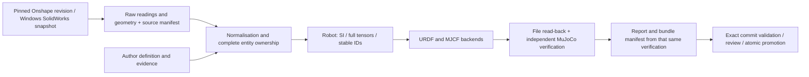

# Engineering contract and runbook

English · [中文](pipeline.md)

## Boundaries and data flow



Responsibilities of the main package `src/description_pipeline`:

| Directory | Responsibility |
|---|---|
| `sources/` | Native identity, freezing, raw readings, source-specific normalisation; never generates consumer XML |
| `model/` | Canonical schema, unique identity, tree/reference, finiteness and physical inertia constraints |
| `backends/` | Projects URDF/MJCF, meshes, mapping and consumer configuration from the canonical model |
| `verification/` | Independent checks over the real files and the actual consumer; keeps the historical URDF rule numbers |
| `build/` | Locks, input digests, cache, stage orchestration, report binding and recoverable publication |
| `repository/` | Asset roles, exact-SHA checks, pull-request submission, re-dispatch and release compare-and-swap |
| `sources/solidworks/deploy/` | Windows install, diagnostic, update and rollback resources that ship with the package |
| `deploy/linux/` | Linux offline installation and model-submission launchers that ship with the package |
| `templates/model/` | The model workspace template that ships with the package |

`main` carries no consumable model for any machine; the robots in `tests/fixtures` and the offline
example in [`examples/`](../examples/) are explicitly labelled fixture evidence
(`evidence_class: fixture`) and never stand for a native CAD capture. The example exists so the
freeze → build → check chain can run on a machine without CAD; real robots stay on
`feature/<hardware>` and `release/<hardware>` branches. There is no second production export engine
and no long-running Linux scheduling service.

The public repository distributes the tool. To keep CAD private, seed a writable private repository
from public `main` and create model branches there; `model init`, submission and promotion use that
repository's `origin`. The pinned tool commit must remain in its `main` ancestry.

## Inputs and authoritative sources

The top level of `config/robot.yaml` accepts `schema_version`, `hardware_id`, `source`, `robot`,
`interfaces` and `overrides`. `source` captures the data; `robot` holds the source-specific
mechanical semantics; `overrides` are the shared, explicit author additions. All of these inputs
participate in the artifact identity, and changing the source configuration requires a new freeze.
`interfaces` adds frames, actuators, sensors, control and contact exclusions during the build and is
shared by both CAD sources. The same interface may not be given different values in the source
definition and in `interfaces`, and duplicate or parent/child-overlapping overrides of one field are
rejected. Duplicate JSON/YAML keys are rejected as well, including fields duplicated after a YAML
merge.

```yaml
schema_version: description.definition/v1
hardware_id: your-hardware
source:
  provider: onshape
  url: https://cad.onshape.com/documents/DOCUMENT/w/WORKSPACE/e/ASSEMBLY
robot:
  # Source-specific grouping, joints and frames; see the source documents
  provider: onshape
overrides:
  - kind: joints
    id: stable-source-joint-id
    field: limits.effort
    value: 1.2
    reason: example; a real value needs mechanical or actuator evidence
    evidence: docs/provenance/actuator-rating.md
```

Example values must never be used on real hardware. An override may only point at a stable object
that exists, and it cannot change identity or the source record. Adding a missing field records
`previously_present: false`; replacing a value keeps `previous`, and the evidence file records its
SHA256. The final schema then checks that the fields are legal. A physical part without a mass can
never be turned into a massless reference frame automatically.

A source snapshot manifest uses `description.source/v1`: `kind`, `identity`, `evidence_class`,
`scene` and per-file digests. A raw CAD assembly may contain several roots, assembly containers and
undefined physical semantics; freezing only validates the source schema. Single root, single parent,
connectivity, acyclicity and complete inertias are enforced after normalisation. Explicit constraints
such as closed loops are preserved in canonical fields, but the current backends do not support a
general projection of them, so the build blocks explicitly.

Handing a captured snapshot to another machine — capture on Windows, build on Linux, or an offline
rebuild — needs no CAD: set `source` to `{provider: snapshot, path: <snapshot directory>}` and run
`source freeze`. The tool verifies every file, copies the snapshot, and the artifact keeps the
`manifest_digest` it was captured with: the source lock, the cache directory and the model identity
are all named after it.

That digest names **one capture**: it covers every file in the snapshot, including the capture
timestamp and SolidWorks' own observations about the documents it opened — for example that it would
prompt to save one. Compare captures, versions or machines by `identity.dependency_digest`, which is
built from each source document's name relative to the assembly directory (compared case-insensitively,
the way the Windows capture does) and its SHA-256 — never from the job directories the capture happened
to run in.

`build` and `check` then read only that snapshot: a machine with no SolidWorks and no worker still
rebuilds the artifacts and re-qualifies them, provided the masses and inertias the definition
declares agree with the snapshot's raw readings. When they do not, the tool reports the difference
link by link and blocks the qualification instead of passing it.

`expected_entities` are the physical leaf instances that take part in the model;
`expected_occurrences` also covers assembly containers and suppressed instances, and the latter two
are reconciled separately. Every physical link claims `source_entities`; excluded fixtures and
reference parts must appear in `excluded_entities` with an id, a reason and evidence. Physical claims
and explicit exclusions may not overlap, and their union must equal the original expected set.
Assembly containers cannot be counted as mass again.

The source oracle recomputes the instance closure, masses, centre of mass and full inertia tensors
directly from the raw assembly transforms and mass readings; it does not reuse the normalisation
fusion function. Exclusions disclose their mass impact together with the actual consumers of the
reference frame, or independent evidence bound inside the snapshot. These checks prove the CAD
baseline; public `overrides` apply after that baseline, `source.author_decisions` keeps the
replacement record, and `source.derivation` reconciles the final model after the overrides. Measured
corrections need not equal the raw CAD values, and they can never bypass the evidence and derivation
checks.

## Tool lock and build identity

A model's tool lock contains the package version, the source commit, the digests of every package
resource, whether the tool is a development build, the exact Python version, the platform and the
complete runtime dependency closure. PowerShell resources, schemas, templates, trust rules and the
dependency locks are all part of the tool digest. The offline bundles on both platforms carry the
complete runtime dependencies and their digests; the Windows bundle also provides COM capture and
MuJoCo verification. Unrelated developer packages installed globally do not affect the model lock.
`requirements/linux-py312.lock` pins the qualified Linux environment; the bundled `win-py312.lock`
pins the Windows environment. A change of platform or Python requires an explicit tool-lock update
and rebuild; results from the old environment are never reused.

Hosted validation first parses the model's tool lock with a standard-library script from `main` and
requires: a full tool SHA, a non-development state, a tool commit that is already part of `main`
history and an explicit package digest. It selects the pinned Ubuntu or Windows runner from the
platform in the lock and installs the exact Python and that tool's dependency lock; a model can never
choose an arbitrary runner or installation command. Verification, simulation acceptance and release
share this environment selection and do not require a tool tag.
CI uses an exact Git checkout of the trusted tool, and the source identity, development state and
content digests must match the model lock. `tools/build_release.py` injects verifiable source
identity into the installation packages; a bare `python -m build` is for development and is not a
release command.

An artifact subject covers `config/`, `sources/`, `model/`, `urdf/`, `mjcf/`, `meshes/` and the
author's documentary evidence. The generated quality report and the application acceptance records
are bound separately so their digests cannot form a cycle. The manifest must contain the digests of
the quality JSON and Markdown; deleting a report entry cannot bypass the gate. A check recomputes the
subject, the report bindings and the consumer semantics instead of trusting a stored `passed`.

Source freezing is reused by manifest content; the consumer generation stage is cached by the digest
of the canonical model, the source, the tool and the purpose. Cached files are inventoried as well,
and corruption blocks the build and requires the affected entry to be cleaned; a cache hit never
skips the verification. Reports record separately whether generation came from the cache, the reuse
key and whether verification actually ran, while preserving the original capture identity; offline
replay does not prove that the current CAD interface works. A build exception keeps the staged
artifacts and `failure.json`; the author inputs are checked again before publication, and input
changes made during a build cannot overwrite an existing delivery.

## Purposes and verification boundaries

| Purpose | Additional requirements |
|---|---|
| kinematics | Consumable model structure, source closure, physical inertia, agreement of both formats, real compilation, rotational/translational FK, geometry and interfaces; contact behaviour is not claimed |
| simulation | Nominal effort/velocity, collision coverage, explicit contact parameters, full mass matrix and gravity terms, multi-pose checks, and the application acceptance the declared scenario needs |
| training | Complete action/observation mapping plus application acceptance in the declared training environment |
| hardware | Native CAD source, complete control mapping and independent physical/HIL acceptance |

All four profiles use the same check chain; a different entry point cannot bypass the shared
contract. Collision may be not applicable for kinematics, but a missing standard URDF limit
(effort/velocity) still blocks delivery; engine defaults of 10/10 are not invented, and 0 is not
used as a placeholder.

Inertia is compared as a full tensor; FK covers joint boundaries, single joints and random poses,
including rotation and translation of a floating base, body and sensor frames. Verification also
compares the actual actuator target/gear/range, sensor type/target, mimic equalities and contact
exclusions. Reference frames must match both the author definition and both artifacts; a continuous
joint keeps effort/velocity and may not gain a position limit in the consumer.
The current `scene.xml` may contain only `robot.xml` and the ground that the purpose configuration
declares; extra defaults, compilers or constraints are rejected so a scene cannot rewrite the body
that was verified.
Dynamic baselines are computed independently from the URDF rigid-body Jacobians and compared pose by
pose against MuJoCo's full mass matrix and zero-velocity gravity terms.
A purpose configuration's `contact` states `friction`, `condim`, `solref`, `solimp`, `margin` and
`gap` explicitly; uniform contact parameters are supported today, are written to the robot's
collision geoms and the scene ground, and the effective engine values are read back.
**`validation_poses` (optional in a purpose configuration)** points at JSON inside `config/`
(a relative path that must not escape `config`). Each pose gives the **complete** movable joint
values and, for a floating base, `base`; `name` is optional and defaults to `pose-<index>`, but when
given it must be non-empty and unique; `poses` must be non-empty, and **the first pose is the state
the consumer resets to**. Format (`schema_version` must be `description.validation-poses/v1`):

```json
{
  "schema_version": "description.validation-poses/v1",
  "poses": [
    {
      "name": "neutral",
      "joints": {"<every moveable joint>": 0.0},
      "base": {"position": [0.0, 0.0, 0.17285394], "rpy": [0.0, 0.0, 0.0]}
    }
  ]
}
```

`joints` must match the set of movable joints **exactly** (a missing, extra or misspelled joint
fails), every value must be finite and inside its limits, and mimic relations must be consistent;
`base` is required only for `root_mode=floating` and declaring it for a fixed base fails.
The penetration threshold is `penetration_m` (default 0.001 m), and a contact distance of exactly 0
(a foot resting exactly on the ground) is not a violation.
Collisions are judged only at these poses against the real `scene.xml` (ground included), which
**proves only that those poses are free of collisions and does not generalise to the whole
workspace**; the full-range FK/dynamics sampling is unchanged (joint boundaries, single joints,
random poses) and does not depend on whether the file is declared. Without it, the legacy policy
("no self-contact in any sampled pose") applies and the check details record the policy name;
declaring it but shipping a missing, malformed or invalid file always fails rather than silently
falling back.
Mesh comparison checks the parsed real files and the actual consumer's spatial bounds; it does not
prove that an arbitrary concave mesh has exactly the same contact surface. Complex collision
approximations still need an author policy and application acceptance; a short simulation without
NaN is not evidence of correct dynamics.

After declaring `link.provenance.inertia_model=uniform_density_visual`, the independent geometry
oracle compares the centre of mass and the full inertia tensor, handling mesh scaling and the frame
the inertia is expressed in; if it cannot be verified, the build blocks. Several visual entities
additionally require `uniform_density_overlap=disjoint`. Tolerances come from the profile's
`uniform_density_rtol`, `uniform_density_com_atol_m` and `inertia_atol`. Left/right symmetry is a
contract only when `provenance.mirror_symmetry_required=true`.
Source mass, the full tensor, positive definiteness and the triangle inequality are always checked.
A strict-rule warning must be resolved or written into `config/urdf_quality.json` as an exception
with an owner, a reason and an expiry date.

### Control interface

`interfaces.control` contains `action_order`, `actions`, `observation_order` and `observations`.
The order lists reference the keys of the channel mapping, and every channel explicitly records
`unit`, `polarity` (1 or -1), `offset` and an `evidence` file. Actions cover every motor, with units
of N or N*m depending on the joint; observations support joint position, joint velocity and single
sensor components. An observation additionally declares `source` (joint_position, joint_velocity or
sensor), `target` and a 0-based `component`.

`description_pipeline.model.control.map_actions` converts the user's order into the actuator order
and computes `polarity * command + offset`, rejecting out-of-range values.
`read_observations` reads the declared components from the actual consumer and returns
`polarity * (raw - offset)`. The robot's geometric zero position is expressed by the mechanical
definition; these offsets only define the coordinate transformation of the control interface.
Verification feeds different channels and non-zero states and compares against an independently
computed control vector and the raw engine observations, checking the order and the calibrated
transform; hardware calibration still needs the separate acceptance described below.

### Application/HIL records

A profile's `acceptance_suites` state the required test names and `consumer_environment` pins the
application and component versions. Simulation, training and hardware are `not_run` without their
scenario acceptance; kinematics also runs an explicitly declared application acceptance.
The record lives in `docs/acceptance/<purpose>.json`:

```json
{
  "schema_version": "description.acceptance/v2",
  "subject": "subject from this build's report",
  "profile_digest": "profile_digest from this build's report",
  "environment": {"controller": "actual version"},
  "results": [{
    "suite": "hardware-smoke",
    "suite_version": "actual application test version",
    "producer": "actual executor/system",
    "executed_at": "2026-09-20T00:00:00Z",
    "passed": true,
    "evidence_class": "physical_measurement",
    "data_role": "validation",
    "used_for_fitting": false,
    "conditions": {"scenario": "actual test scenario"},
    "artifacts": {"docs/acceptance/hardware-smoke.log": "log sha256"},
    "validation_data": {"docs/acceptance/hardware-smoke.log": "log sha256"}
  }],
  "attestation": {"repository": "org/application-repo", "run_id": 123456, "artifact_id": 654321}
}
```

First run the real application test with the exact artifact named in the failure diagnostics, keep
the log and the record above, then rebuild and check the same subject. Simulation produces a local
replay record through `description model accept` by default; see
[simulation acceptance](simulation.en.md). Later builds, checks and releases re-run every experiment
with the pinned tool and compare the measurements and telemetry digests item by item; the record is
pinned to `config/simulation-acceptance.json`, the input identity, the purpose and the actual
environment and cannot attest itself with `passed`.
This route supports simulation only and never grants training or hardware qualification.

The example above is the external attestation format. The pipeline checks the repository, workflow
and branch registered in the shared `verification/acceptance_trust.json`, confirms a successful run
titled `accept <subject> (<purpose>)` and downloads the raw material from that run's GitHub
artifact. The artifact must contain an `acceptance.json` without the attestation field plus the logs
at the same paths, and both records and bytes must agree. A trust entry is registered by the tool
maintainers when a real application test is integrated; a candidate model may not add one.
Evidence that is unregistered, unreachable or expired grants nothing.
Hardware records accept only `physical_measurement`; fitted data, copies of model inputs and records
from a mismatched environment are rejected.
Reports label `local_replay` and `external_attestation` separately. Local simulation replays offline;
a purpose that needs external attestation stays unqualified until the evidence can be checked.

## Windows SolidWorks

SolidWorks COM runs on a Windows machine with a licensed SolidWorks. The worker runs as an
interactive user logon task and is never installed as a Session 0 service. All COM access executes
serially on one STA thread; HTTP request threads never touch COM directly. The workspace, version
directories, job records, freeze output and the original CAD are kept separate.

Freezing starts from CAD files saved on disk: it reads the dependency graph in an isolated process,
copies the files and relocates references, reopens the copy to verify closure, and only then
collects raw readings and geometry. Missing dependencies, escaping dependencies and geometry
failures block the run. SolidWorks' own "needs saving" flag (`GetSaveFlag`) is recorded as evidence
and reported by doctor instead of blocking, because the capture reads the bytes on disk and the flag
cannot stand for an operator's unsaved edits. Jobs persist queued/running/succeeded/failed/cancelled, attempts
and heartbeats; a restart resumes the queue that has not started, while an interrupted freeze that
cannot prove its original inputs must be captured again. The watchdog never terminates the user's
CAD process.

Installation, process liveness and CAD collectability are reported separately by doctor. An update
requires an idle worker and keeps the previous version for rollback. The concrete interface,
configuration and commands are in the
[SolidWorks deployment notes](sources/solidworks.en.md). Real desktop and licence availability must be
measured on the host; Linux unit tests can only prove the protocol, scheduling and data contracts.

Capture owns the CAD processes of the original and the copy separately; normal completion, failure
and timeouts only clean up that job's process tree. It never attaches to the operator's SolidWorks
and never reads their unsaved edits.

## Submission, acceptance and release

`description model update` chains preflight, capture, build and submission while holding the model
workspace for the whole run. The complete author flow runs locally by default: Windows supports
SolidWorks and Onshape, Linux supports Onshape and frozen snapshots. On Windows, `submit.ps1` uses
the complete local runtime by default. Remote capture is optional: on Linux, `--worker-host
SSH_ALIAS` connects to the Windows worker automatically and keeps the tunnel only for the capture.
When only the definition or the evidence changed, `--reuse-source` re-verifies the source
configuration and snapshot digests and builds without touching CAD; a failed capture never degrades
silently into snapshot reuse. Both modes check the branch, Git/LFS, the GitHub login and the tool
lock first, and push only after the build passes. The default commit message is
`Update <hardware> model`; `--message` or `--message-file` override it explicitly.

1. A developer updates with `description model update`, or submits an already built candidate with
   `description model submit`. Candidates only land on a review branch
   `work/model/<hardware>/<change>`: running from `feature/<hardware>` creates the review branch
   first and never advances the feature branch, while re-running on the same review branch updates
   the same pull request. GitHub Actions are not dispatched by default; a successful pull-request
   creation completes the submission, and a failure keeps the candidate branch and prints the retry
   command.
   When `feature/<hardware>` moved on in the meantime the tool does **not** block the submission, but
   it prints a `note:` that the review branch no longer contains the current base — a reviewer would
   merge artifacts built on an older base — together with the two commands that fix it
   (`git fetch origin`, `git merge origin/feature/<hardware>`) and the `description model submit`
   command to re-run. The note disappears once the base is merged.
2. Review the candidate with `description diff OLD_SHA <candidate> --repository <repository>`: one
   line on stderr names the changed areas, the object counts and whether the delivery digest moved,
   and the full JSON report stays on stdout (`--json` prints that report alone).
   After review and merge into the feature branch, run `description model promote` in the model's
   pinned tool environment. It **verifies and prints the plan by default**; add `--apply` to publish.
   The plan confirms the candidate's ownership (the candidate must be an ancestor of
   `feature/<hardware>`), the fast-forward relationship of the release branch, and that the `--tag`
   is still free.
3. It fetches that commit from the remote into a fresh Git/LFS store, re-verifies the source, the
   runtime dependencies, the manifest and the purposes, and confirms the pinned tool belongs to
   `main`. The whole process runs locally and does not depend on GitHub CI.
4. On success it writes the `description/release` release-qualification status and advances the
   release branch with a lease on the old remote SHA. `--tag` is an optional alias;
   `--review-evidence` attaches the approval evidence of the merged pull request. The repository's
   existing branch protection stays in force. With `--apply` the command re-runs the plan first and
   refuses a stale one — a release branch, previous SHA or subject that moved is re-verified instead
   of being pushed against.

That push goes through git-lfs's pre-push lock check. When the endpoint cannot answer — measured on
the v0.3.21 Windows promotion, which got `Git LFS locks/verify returned EOF` and left the release
branch unchanged — `model promote` retries the **same** `--atomic`/`--force-with-lease` push once
with the lock query disabled for that push (`lfs.locksverify=false`, including the URL-scoped key
git-lfs caches); the object upload and git-lfs's integrity verification are unchanged, a real lock
conflict still fails, and the result carries an `lfs_lock_verify_unavailable` advisory saying that the
query did not run.

An already pushed exact commit can also be checked independently, with the report kept:

```sh
description model validate --root MODEL --candidate FULL_MODEL_SHA \
  --profile kinematics --remote --report RESULT/validation.json
```

"Pinned tool environment" is more than a tool version: the lock names the platform and the exact
Python patch release, and the tool identity binds the whole runtime dependency closure. Re-verifying
a released model means reproducing that environment, not approximating it:

- the platform and Python the lock names — a Linux run of a Windows-locked model is refused with
  `Toolchain differs from lock (platform)`, by design, because Windows and Linux records never stand
  in for each other;
- the **published wheel** of the locked tool version, installed with `--no-deps`;
- the lock's `dependencies` installed as written (`pip install -r` the pins), rather than whatever
  today's resolver would choose.

To see the same contract state for **every** model branch at once — each one checked out into its own
temporary worktree and run through the strict audit, with a JSON report for the record:

```sh
python tools/audit_branches.py --json build/branch-audit.json
```

A model's hardware_id must match the branch and release namespace. Local acceptance still requires
the real source, the pinned tool, the complete assets and the evidence for the purpose; disabling CI
never relaxes the physical and control acceptance requirements.

GitHub Actions are currently disabled and take no part in submission, acceptance or release. Every
qualification decision is made locally in the pinned tool environment. If Actions are restored
later they are additional evidence only and never replace the independent acceptance of source,
artifacts and consumers.

`.github/rulesets/` contains example protections for model development, model release and immutable tags.
Apply them to the writable model repository without removing its existing protections.

## Failure handling

- **Source configuration changed:** freeze again; never hand-edit the lock.
- **Tool lock differs:** confirm the tool upgrade, run `description tool lock` and rebuild; a
  production model must lock a tool commit from `main` history.
- **Source or cache digest differs:** find out why it changed, delete the corrupt cache and rebuild
  from the saved authoritative input; never rewrite a hash to hide tampering.
- **`build/failed/`:** read the complete quality.json and fix the input or add evidence; never copy a
  failure directory over a consumer entry point.
- **publication.json exists:** confirm no publisher is active, then run `description recover`; a
  recovery returns to the pre-publication entry point.
- **Source API unavailable:** only a frozen, fully verified snapshot may be reused, and its capture
  mode and original capture time are preserved.
- **CAD machine offline:** the queue and diagnostics must report the run as not executed; fixture
  success is never a substitute for on-site acceptance.

## Known capability limits

The current backends support tree-shaped rigid bodies, fixed/revolute/continuous/prismatic joints,
motors, six site-sensor kinds, linear mimic, explicit contact exclusions and
mesh/box/sphere/cylinder geometry. General closed loops, soft bodies and other unsupported semantics
are rejected explicitly. Real hardware/training acceptance is provided by the consumer's test
suite; arbitrary scripts from a model repository are never executed, so an asset branch cannot gain
tool execution rights. Historical tools are kept only for reading existing sources and regression;
new production builds use `description` exclusively.

Onshape's `source.revision` requires per-request identity and immutable revision evidence. With only
a historical cache, a missing request index or element micro-versions alone, the pipeline can still
produce diagnostics and run the physical checks, but it cannot complete qualification acceptance.
Pinning snapshot bytes and proving that every CAD reading came from the same revision are two
different requirements.
