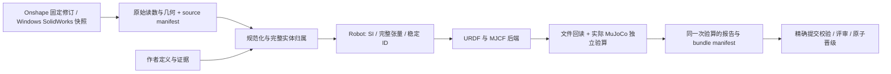

# 工程契约与运行手册

[English](pipeline.en.md) · 中文

## 边界与数据流



主包 `src/description_pipeline` 的职责：

| 目录 | 责任 |
|---|---|
| `sources/` | 原生身份、冻结、原始量、来源特有规范化；不生成消费者 XML |
| `model/` | 规范 schema、唯一身份、树/引用、有限值和物理惯量约束 |
| `backends/` | 从规范模型投影 URDF/MJCF、网格、映射和消费者配置 |
| `verification/` | 从真实文件和实际消费者独立检查，保留历史 URDF 规则编号 |
| `build/` | 锁、输入摘要、缓存、阶段编排、报告绑定与可恢复发布 |
| `repository/` | 资产角色、指定 SHA 检查、PR 提交、补发和发布比较交换 |
| `sources/solidworks/deploy/` | 随包分发 Windows 安装、诊断、更新、回滚资源 |
| `deploy/linux/` | 随包分发 Linux 离线安装与模型提交入口 |
| `templates/model/` | 随包分发模型工作区模板 |

main 不承载某台机器的可消费模型；`tests/fixtures` 中的机器人与 [`examples/`](../examples/) 中的离线示例
都只是明确标注的夹具证据（`evidence_class: fixture`），不代表原生 CAD 采集。示例用于在没有 CAD 的机器上
跑通冻结 → 构建 → 检查，真实机器人仍在 `feature/<hardware>` 与 `release/<hardware>` 分支上。

公共仓库负责分发工具。若 CAD 需保密，先以公共 `main` 初始化可写的私有仓库，再在那里创建模型分支；
`model init`、提交和发布使用该仓库的 `origin`，模型锁定的工具提交必须属于它的 `main` 历史。
没有另一个生产导出引擎或长期运行的 Linux 调度服务。

## 输入与权威来源

`config/robot.yaml` 的顶层接受 `schema_version`、`hardware_id`、`source`、`robot`、`interfaces`、`overrides`。
`source` 负责取数；`robot` 是来源特有的机械语义定义；`overrides` 是公共的显式作者补充。
这些输入均参与产物身份；更改来源配置后必须重新冻结。
`interfaces` 在构建阶段补充 frames、actuators、sensors、control 和 contact_excludes，两种 CAD 来源共用。
同一接口不能同时在来源定义和 interfaces 中给出不同值；同一字段的重复或父子重叠 override 会被拒绝。
JSON/YAML 重复键也会被拒绝，包括 YAML 合并后重复的字段。

```yaml
schema_version: description.definition/v1
hardware_id: your-hardware
source:
  provider: onshape
  url: https://cad.onshape.com/documents/DOCUMENT/w/WORKSPACE/e/ASSEMBLY
robot:
  # 具体来源的分组、关节、参考系定义，见来源文档
  provider: onshape
overrides:
  - kind: joints
    id: stable-source-joint-id
    field: limits.effort
    value: 1.2
    reason: 示例；实际值必须有机械/执行器依据
    evidence: docs/provenance/actuator-rating.md
```

示例数值不能直接用于实物。覆盖只能指向存在的稳定对象，不能改身份或来源记录。
补充缺失的字段会记录 `previously_present: false`；替换值会保留 `previous`，证据文件记录 SHA256。
最终 schema 再检查字段是否合法。缺质量的物理零件不能被自动变成无质量参考系。

来源快照清单使用 `description.source/v1`：`kind`、`identity`、`evidence_class`、`scene` 和逐文件摘要。
原始 CAD 装配可以包含多根、装配容器和未定义物理语义；冻结只验证来源 schema。
规范化之后才强制单根、单父、连通、无环与完整惯量。闭环等约束保留在规范字段，但当前后端
尚未支持通用投影，构建会明确阻断。

把已采集的快照交给另一台机器（Windows 采集、Linux 构建，或离线重建）不需要 CAD：
把 `source` 换成 `{provider: snapshot, path: <快照目录>}` 后运行 `source freeze`，
工具逐文件核对摘要并复制该快照，产物的 `manifest_digest` 与采集时相同——来源锁、缓存目录
与模型身份都按这个摘要命名。

该摘要标识**这一次采集**：它覆盖快照内的每个文件，其中包含采集时间与 SolidWorks 对它所打开文档
的观测（例如它是否认为某个文档需要保存）。跨采集、跨版本或跨机器比较请用
`identity.dependency_digest`——它由每个源文档**相对于装配目录的名字**（按 Windows 采集端的大小写不敏感
比较）与 sha256 组成，与采集运行在哪个 job 目录无关。

之后的 `build` 与 `check` 只读这个快照：没有 SolidWorks、没有 worker 的机器同样能重建产物并复核资格，
前提是声明里的质量与惯量证据与快照的原始读数一致——不一致时工具逐 link 报出差异并阻断资格，不会放行。

`expected_entities` 表示参与模型的物理叶实例；`expected_occurrences` 包含装配容器及抑制实例，后二者另行对账。
每个物理 link 认领 `source_entities`；被排除的夹具/参考件必须有 `excluded_entities` 的 id、原因、证据。
物理认领与明确排除不能重复，合集必须等于原始期望集合。装配容器不能被再计为质量。

来源 oracle 直接从 raw 装配变换和质量读数重算实例闭合、质量、质心与完整惯量，
不复用规范化的融合函数。排除项披露质量影响及实际参考系消费方或快照内绑定的独立证据。
这组检查证明 CAD 基线；公共 `overrides` 在基线之后生效，`source.author_decisions` 保存替代记录，
`source.derivation` 对账覆盖后的最终模型。实测修正不必等于 CAD 原始量，也不能绕过证据与派生检查。

## 工具锁与构建身份

模型工具锁包含包版本、源提交、全部包资源摘要、是否开发状态、精确 Python 版本、平台和完整运行依赖版本闭包。
PowerShell、schema、模板、信任规则和依赖锁均参与工具摘要。两端离线包包含完整运行依赖及摘要；Windows 包同时提供 COM 采集和 MuJoCo 验证。
全局其他开发包不影响模型锁。`requirements/linux-py312.lock` 固定受验收 Linux 环境的全部包；
Windows 环境由随包 `win-py312.lock` 固定。平台或 Python 变化时显式更新工具锁并重建，不复用旧环境结论。

GitHub 校验先用 main 上的标准库脚本解析模型工具锁，要求：完整工具 SHA、非开发状态、
工具提交已属于 main 历史、包摘要明确。依据锁中的平台选择固定的 Ubuntu 或 Windows runner，并安装精确 Python 与该工具的依赖锁；模型不能指定任意 runner 或安装命令。验证、仿真验收和发布共用这一环境选择，不要求工具标签。
CI 使用受信任工具的精确 Git 检出，源码身份、开发状态和内容摘要均须与模型锁一致。
安装包由 `tools/build_release.py` 注入可核对的源码身份；裸 `python -m build` 只用于开发，不是发布命令。

产物 subject 覆盖 `config/`、`sources/`、`model/`、`urdf/`、`mjcf/`、`meshes/` 和作者文档证据。
生成的质量报告及应用验收记录分开绑定，避免循环摘要。manifest 必须包含质量 JSON/Markdown 的摘要，
删掉报告条目不会绕过门禁。检查时重算 subject、报告绑定和消费者语义，不只看已存的 `passed`。

来源冻结按 manifest 内容复用；消费者生成阶段按规范模型、来源、工具和用途的摘要缓存。
缓存文件也做完整清单校验，损坏时阻断并要求清理对应项。缓存命中不会跳过验算。
报告分别记录生成是否命中缓存、复用键和本次验证执行情况，并保留原始采集身份；离线回放不证明当前 CAD 接口可用。
构建异常保留暂存产物及 failure.json；发布前再次核对作者输入，构建期间的输入变更不会覆盖已有交付。

## 用途与验证边界

| 用途 | 增量要求 |
|---|---|
| kinematics | 可消费模型结构、来源闭合、物理惯量、两格式一致、实际编译、旋转/平移 FK、几何与接口；不承诺碰撞行为 |
| simulation | 正额定 effort/velocity、碰撞覆盖、显式接触参数、完整质量矩阵/重力项、多姿态检查，以及声明场景的应用验收 |
| training | 完整动作/观测映射，以及指定训练环境中的应用验收 |
| hardware | 原生 CAD 来源、完整控制映射及独立实物/HIL 验收 |

四种 profile 都使用同一个检查链，不能通过改入口绕过通用合同。kinematics 中 collision 可不适用，
但标准 URDF limit 必需的 effort/velocity 缺失仍阻止交付；不填引擎默认 10/10，也不填 0 作占位。

惯量比较完整张量；FK 覆盖关节边界、单关节、随机姿态，以及浮动基座、body 与传感器 frame 的旋转和平移。
验证额外比较实际 actuator target/gear/range、sensor 类型/目标、mimic 等式和接触排除。
参考系须同时匹配作者定义与两种产物；continuous 关节保留 effort/velocity，不能在消费者中增加位置限位。
当前 `scene.xml` 只允许包含 `robot.xml` 和用途配置声明的地面；额外 defaults、compiler 或约束会被拒绝，防止场景改写已验算的本体。
动力学基准从 URDF 刚体雅可比独立计算，逐姿态比较 MuJoCo 完整质量矩阵和零速度重力项。
用途配置的 `contact` 显式给出 `friction`、`condim`、`solref`、`solimp`、`margin`、`gap`；
当前支持统一接触参数，写入机器人碰撞体和场景地面，并重新读取引擎中的有效值。
**`validation_poses`（用途配置可选）**：指向 `config/` 内的 JSON（相对路径，不得越出 `config`）。
每个姿态给出**完整**的可动关节值与（浮动基座的）`base`；`name` 可选，缺省为 `pose-<序号>`，
给出时必须非空且唯一；`poses` 非空，**第一个姿态即消费者 reset 的起始状态**。
格式（`schema_version` 必须是 `description.validation-poses/v1`）：

```json
{
  "schema_version": "description.validation-poses/v1",
  "poses": [
    {
      "name": "neutral",
      "joints": {"<every moveable joint>": 0.0},
      "base": {"position": [0.0, 0.0, 0.17285394], "rpy": [0.0, 0.0, 0.0]}
    }
  ]
}
```

`joints` 必须与可动关节集合**完全一致**（缺、多、拼错都失败），值必须有限且在限位内，mimic 关系自洽；
`base` 仅 `root_mode=floating` 需要，固定基座声明即失败；穿透阈值 `penetration_m`（默认 0.001 m），
接触距离恰为 0（脚掌正好落地）不算违规。
碰撞只在这些姿态上判定，跑真实 `scene.xml`（地面计入），**只证明这些姿态无碰撞，不外推到整个工作空间**；
全范围 FK/动力学采样不变（关节边界、单关节、随机姿态）且与是否声明该文件无关。
未声明时沿用旧的"全部采样姿态不得自接触"策略并在检查详情记录策略名；声明但缺失、形状或姿态非法一律判失败，不静默回退。
网格比较检查解析后的真实文件与实际消费者空间包围范围；它不证明任意凹形网格的接触面完全相同。
复杂碰撞近似仍需作者策略及应用验收，不以短时仿真无 NaN 代替动力学正确性。

声明 `link.provenance.inertia_model=uniform_density_visual` 后，独立几何验算比较质心和完整惯量张量，
处理网格缩放及惯量表达坐标系；无法验算即阻断。多视觉实体还须声明 `uniform_density_overlap=disjoint`。
容差由 profile 的 `uniform_density_rtol`、`uniform_density_com_atol_m` 和 `inertia_atol` 给出。
左右对称只在 `provenance.mirror_symmetry_required=true` 时作为合同。
来源质量、完整张量、正定性和三角不等式始终检查。
严格规则警告必须处理或在 `config/urdf_quality.json` 写具备负责人、原因和有效期的例外。

### 控制接口

`interfaces.control` 包含 `action_order`、`actions`、`observation_order`、`observations`。
顺序列表引用通道映射的键，每个通道显式记录 `unit`、`polarity`（1 或 -1）、`offset` 和证据文件 `evidence`。
动作覆盖全部 motor，其单位按关节为 N 或 N*m；观测支持关节位置、速度及传感器的单个分量。
观测另外声明 `source`（joint_position、joint_velocity 或 sensor）、`target` 和从 0 开始的 `component`。

`description_pipeline.model.control.map_actions` 将用户顺序转换到执行器顺序，计算 `polarity * command + offset`，越界即拒绝。
`read_observations` 从实际消费者读取声明分量，按 `polarity * (raw - offset)` 输出观测。
机器人几何零位由机械定义表达；这些偏移只定义控制接口的坐标转换。
验证用不同通道输入与非零状态，对照独立计算的控制向量及原始引擎观测，检查顺序和标定转换；实机标定还需下面的独立验收。

### 应用/HIL 记录

profile 的 `acceptance_suites` 明确所需测试名，`consumer_environment` 固定应用及组件版本。
仿真、训练、实机缺少场景验收时为 `not_run`；运动学也会执行主动声明的应用验收。
记录放在 `docs/acceptance/<purpose>.json`：

```json
{
  "schema_version": "description.acceptance/v2",
  "subject": "本次构建报告中的 subject",
  "profile_digest": "本次构建报告中的 profile_digest",
  "environment": {"controller": "实际版本"},
  "results": [{
    "suite": "hardware-smoke",
    "suite_version": "实际应用测试版本",
    "producer": "实际执行者/系统",
    "executed_at": "2026-09-20T00:00:00Z",
    "passed": true,
    "evidence_class": "physical_measurement",
    "data_role": "validation",
    "used_for_fitting": false,
    "conditions": {"scenario": "实际测试工况"},
    "artifacts": {"docs/acceptance/hardware-smoke.log": "日志 sha256"},
    "validation_data": {"docs/acceptance/hardware-smoke.log": "日志 sha256"}
  }],
  "attestation": {"repository": "组织/应用仓库", "run_id": 123456, "artifact_id": 654321}
}
```

先用失败诊断中的精确产物执行真实应用测试，保存日志和上述记录，再对相同 subject 重建/检查。
仿真默认用 `description model accept` 产生本地重放记录，详见[仿真验收](simulation.md)。
后续 build、check 和发布均使用锁定工具重新运行全部实验，逐项比较测量结果和遥测摘要；
记录固定到 `config/simulation-acceptance.json`、输入身份、用途与实际环境，不能凭 `passed` 自证。
这种方式只支持仿真，不授予训练或实机资格。

上例是外部凭证格式。流水线核对公共工具 `verification/acceptance_trust.json` 登记的仓库、workflow 和分支，
确认成功运行标题为 `accept <subject> (<purpose>)`，并从该运行的 GitHub artifact 下载原始材料。
artifact 内须含不带 attestation 字段的 `acceptance.json` 及同路径日志，记录和字节均须一致。
信任方由工具维护者在接入真实应用测试时登记；候选模型不能自行添加。未登记、无法取得或过期的证据不授予资格。
实机记录只接受 physical_measurement；拟合数据、模型输入的副本和环境不符的记录均被拒绝。
报告分别标记 `local_replay` 或 `external_attestation`。本地仿真可离线重放；需要外部凭证的用途在证据无法核实时保持未获资格。

## Windows SolidWorks

SolidWorks COM 运行在装有授权 SolidWorks 的 Windows 机器上。worker 通过交互式用户登录任务运行，
不安装成 Session 0 服务。所有 COM 访问在同一 STA 线程串行执行；HTTP 请求线程不直接接触 COM。
工作区、版本目录、作业记录、冻结输出与 CAD 原件分开。

冻结从磁盘上已保存的 CAD 文件开始：在隔离进程中读取依赖图，复制文件并重定位引用，重新打开副本验证闭包后采集原始读数和几何。
缺依赖、逃逸依赖或几何失败会阻断。SolidWorks 自己的"是否需要保存"标志（`GetSaveFlag`）只写进证据并由
doctor 提示操作者，不阻断采集：采集读取磁盘上的字节，这个标志无法代表操作者是否有未保存编辑。
作业持久化 queued/running/succeeded/failed/cancelled、
attempt 和心跳；重启恢复未开始的队列，已中断且无法证明原始输入的冻结要求重采。看门狗不结束用户 CAD 进程。

安装、进程存活和 CAD 可采集由 doctor 分项报告。更新前确认空闲，保留旧版本以便回滚。
具体接口、配置与命令见 [SolidWorks 部署说明](sources/solidworks.md)。真实桌面/许可可用性必须实测，
Linux 单测只能证明协议、调度和数据合同。

采集分别拥有原件与副本的 CAD 进程；正常结束、失败和超时仅清理本作业的进程树。不会附着操作者的 SolidWorks，也不会读取其未保存编辑。

## 提交、验收与发布

`description model update` 串联预检、采集、构建和提交，全程锁定模型工作区。
默认在本机完成全部作者流程：Windows 支持 SolidWorks 与 Onshape，Linux 支持 Onshape 与冻结快照。
Windows 的 `submit.ps1` 默认调用本机完整运行环境。跨机采集是可选项：Linux 加 `--worker-host SSH_ALIAS` 自动连接 Windows worker，隧道只在采集期间保留。只改定义或证据时用 `--reuse-source`，
它重新核对来源配置和快照摘要后构建，不访问 CAD；采集失败不会自动降级为快照复用。
两种模式均先检查分支、Git/LFS、GitHub 登录和工具锁，构建通过后才推送。
默认提交信息为 `Update <hardware> model`；`--message` 或 `--message-file` 可显式覆盖。

1. 开发者使用 `description model update` 完成更新，或用 `description model submit` 提交已构建的候选。
   候选只落在审查分支 `work/model/<hardware>/<change>` 上：从 `feature/<hardware>` 运行时先建审查分支再提交，
   不推进 feature；在同一审查分支复跑则更新同一个 PR。默认不调度 GitHub Actions，PR 创建成功即完成提交；创建失败保留候选分支并给出重试命令。
   如果 `feature/<hardware>` 在此期间前进过，工具**不阻断**提交，但会打印一条 `note:`：审查分支没有包含当前基分支、
   审阅者合入的会是基于旧基线的产物，并给出两条修复命令（`git fetch origin`、`git merge origin/feature/<hardware>`）
   与重跑 `description model submit` 的命令。合入基分支后提示自行消失。
2. 审阅候选时先跑 `description diff OLD_SHA <候选> --repository <仓库>`：stderr 一行给出变化的区域、对象数量和交付摘要是否变化，
   完整 JSON 报告在 stdout（`--json` 只输出报告）。审阅通过并合入 feature 后，在模型锁定的工具环境中运行 `description model promote`：**默认只验证并打印计划**，
   加 `--apply` 才发布。计划阶段确认候选归属（候选必须是 `feature/<hardware>` 的祖先）、release 的快进关系，
   以及 `--tag` 仍然可用。
3. 使用全新的 Git/LFS 存储从远端取回该提交，重新核验来源、运行依赖、清单与用途，并核对固定工具属于 main。整个过程在本机执行，不依赖 GitHub CI。
4. 通过后写入 `description/release` 发布资格状态，用远端旧 SHA 的 lease 推进 release。`--tag` 是可选别名；`--review-evidence` 可附上已合并 PR 的批准证据。仓库原有分支保护继续生效。带 `--apply` 时会**先重跑计划**：release 分支、旧 SHA 或 subject 变了就拒绝，绝不基于过期计划推送。

这一推送会经过 git-lfs 的 pre-push 锁检查。端点不可达时（实测：0.3.21 的 Windows 晋级推送收到
`Git LFS locks/verify returned EOF`，release 分支保持不变），`model promote` 用**同一组**
`--atomic`/`--force-with-lease` 参数重推一次，只关掉这一次推送的锁查询（`lfs.locksverify=false`，
并带上 git-lfs 缓存过的 URL 级键）；对象上传与 git-lfs 的完整性校验不变，真正的锁冲突照旧失败，
返回结果里带一条 `lfs_lock_verify_unavailable` advisory 说明这次查询没有执行。

也可先独立检查已推送的精确提交，并保存报告：

```sh
description model validate --root MODEL --candidate FULL_MODEL_SHA \
  --profile kinematics --remote --report RESULT/validation.json
```

"锁定工具环境"不只是一个工具版本：锁里写明平台与**精确的 Python 补丁版本**，工具身份还绑定整套运行时
依赖闭包。复验一个已发布模型意味着**复现**这个环境，而不是近似它：

- 锁里写明的平台与 Python——用 Linux 复验 Windows 锁定的模型会被拒绝
  （`Toolchain differs from lock (platform)`），这是设计如此：两个平台的记录不互相顶替；
- 锁定工具版本的**已发布 wheel**，用 `--no-deps` 安装；
- 锁里 `dependencies` 的精确版本（`pip install -r` 这些钉版），而不是让今天的依赖解析器替它选。

想看**所有模型分支**的同一份合同状态（每个分支各自一个临时 worktree 跑严格审计，并留下 JSON 报告）：

```sh
python tools/audit_branches.py --json build/branch-audit.json
```

模型 hardware_id 必须匹配分支与发布命名空间。本地验收仍要求真实来源、固定工具、完整资产及相应用途的证据；停用 CI 不放宽物理和控制验收要求。

GitHub Actions 当前停用，不参与提交、验收或发布。所有资格判定在锁定工具环境中本机完成；
若未来恢复 Actions，必须作为附加证据，不能替代来源、产物和消费者的独立验收。

`.github/rulesets/` 提供模型开发、模型发布和不可变标签的示例保护规则。安装到可写的模型仓库时保留其已有保护。

## 失败处理

- source 配置改变：重新冻结，不手工改 lock。
- 工具锁不同：确认工具升级，运行 `description tool lock` 后重建；正式模型须锁定 main 历史中的工具提交。
- source 或 cache 摘要不同：查明变更原因，删除损坏缓存后从保存的权威输入重建；不重新计算哈希掩盖篡改。
- `build/failed/`：查看完整 quality.json，修输入或补证据；不要把失败目录手工覆盖到消费者入口。
- publication.json 存在：先确认没有活动发布者，再 `description recover`；恢复会回到发布前入口。
- 来源 API 不可用：只能复用已冻结且完整验证的快照，并保留 capture 模式和原始采集时间。
- CAD 机器离线：队列/诊断必须报告未执行，不能以夹具成功替代现场验收。

## 已知能力边界

当前后端支持树状刚体、fixed/revolute/continuous/prismatic、motor、六类 site sensor、线性 mimic、显式 contact exclude，
以及 mesh/box/sphere/cylinder。通用闭环、弹性体和其他不支持语义会明确拒绝。
实际 hardware/training 验收由消费者测试套件提供；不执行任意模型仓库脚本，以免资产分支取得工具执行权限。
历史工具只用于既有来源读取/回归，新的生产构建统一使用 `description`。

Onshape 的 `source.revision` 要求逐请求身份和不可变修订证据。只有历史缓存、缺请求索引或
只保留元素微版本时，仍可生成诊断并运行物理检查，但不能据此完成资格验收。
固定 snapshot 字节与证明所有 CAD 读数来自同一修订是两项不同要求。
